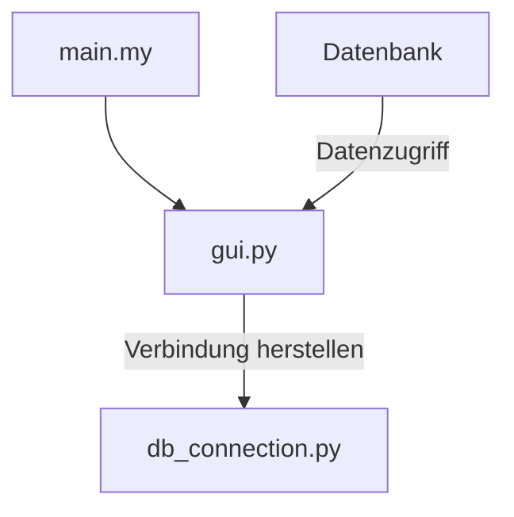

# rent-a-room
## Raummanaging Software ählich wie AirBNB
Gibb Modul 165


## create db script
```
use rent-a-room
```

## create collection
```
db.createCollection("rooms")
db.createCollection("persons")
```

## insert room documents
```
db.rooms.insertOne({ 
    "name": "Studio zum Arbeiten",  
    "beschreibung": "Ein Studio mit guter Belichtung. Perfekt zum Arbeiten!",  
    "ort": {  
        "type": "Point",  
        "koordinaten": [13.4050, 52.5200] 
    },  
    "bewohner_ids": ["max.muster@mail.com ", "marian.mueller@mail.ch"], 
    "besitzer_id": "friedrich.meier@mail.ch", 
    "zimmer": 2,  
    "fläche": 20,  
    "gebucht_von": ISODate("2024-03-14T00:00:00Z"), 
    "gebucht_bis": ISODate("2024-03-21T00:00:00Z") 
}) 
```

## insert persons documents
``` 
db.persons.insertOne({ 
  "_id": "max.mustermann@example.com", 
  "vorname": "Max", 
  "nachname": "Mustermann", 
  "alter": 30, 
  "geschlecht": "männlich", 
  "telefon": "0123456789", 
  "email": "max.mustermann@example.com" 
}); 

 
```

## Update a room
```
db.rooms.update( 
  { _id: ObjectId("65f321caeb1f6bbd3a48cf49") }, 
  {  
    $set: {  
      "bewohner_ids": ["max.mustermann@example.com", "friedrich.meier@mail.ch"],  
      "gebucht_von": ISODate("2024-03-11T00:00:00Z"), 
      "gebucht_bis": ISODate("2024-03-18T00:00:00Z") 
    }  
  } 
) 
```
 
## update a person
```
db.persons.update( 
  { _id: "max.mustermann@example.com" }, 
  {  
    $set: {  
      "telefon": "9876543210"  
    }  
  } 
) 
```

## löschen
```
db.rooms.deleteOne({ _id: ObjectId("65f321caeb1f6bbd3a48cf49") }) 
```
```
db.persons.deleteOne({ _id: "max.mustermann@example.com” }) 
```


## dynamik

### vollständige collection 
```
{ 
  "name": "Studio zum Arbeiten",  
  "beschreibung": "Ein Studio mit guter Belichtung. Perfekt zum Arbeiten!",  
  "ort": {  
      "type": "Point",  
      "koordinaten": [13.4050, 52.5200] 
  },  
  "bewohner_ids": ["max.muster@mail.com ", "marian.mueller@mail.ch"], 
  "besitzer_id": "friedrich.meier@mail.ch", 
  "zimmer": 2,  
  "fläche": 20,  
  "gebucht_von": ISODate("2024-03-14T00:00:00Z"), 
  "gebucht_bis": ISODate("2024-03-21T00:00:00Z") 
} 
```

### nicht gebuchter raum, ohne "bewohner_ids" und ohne "gebucht von/bis" 

```
{ 
  "name": "Studio zum Arbeiten",  
  "beschreibung": "Ein Studio mit guter Belichtung. Perfekt zum Arbeiten!",  
  "ort": {  
      "type": "Point",  
      "koordinaten": [13.4050, 52.5200] 
  },  
  "besitzer_id": "friedrich.meier@mail.ch", 
  "zimmer": 2,  
  "fläche": 20 
} 
```
 

### nicht gebuchter raum und ohne "Beschreibung" 

```
{ 
  "name": "Studio zum Arbeiten",  
  "ort": {  
      "type": "Point",  
      "koordinaten": [13.4050, 52.5200] 
  },  
  "besitzer_id": "friedrich.meier@mail.ch", 
  "zimmer": 2,  
  "fläche": 20 
} 
```

## Daten anzeigen

### eine entität anzeigen 

```
db.rooms.findOne({ _id: ObjectId("65f321caeb1f6bbd3a48cf49") }) 
db.persons.findOne ({ _id: "max.mustermann@example.com" }) 
```

### alle entitäten anzeigen 

```
db.rooms.find() 
db.persons.find() 
```
 

### sortieren nach anzahl Zimmer 
```
db.rooms.find().sort({"zimmer": -1}) 
```

### finde nach beschreibung 
```
db.rooms.find({"beschreibung": "grosses Haus"}) 
```
 

### finde raum grösser als quadratmeter 
```
db.rooms.find({"fläche": { $gt: 100 } }) 
```

## sonstiges, für uns relevant

Realistisches Anzeigen von Daten, wie sie in etwa in der App funktionieren:

[Alle]
- Alle LEEREN Räume finden, egal wo
- Sortieren/Filtern nach Ort, Fläche, Zimmeranzahl etc.

[Nur jeder User für sich]
- Den Raum anzeigen, welchen man besitz
- Den Raum anzeigen, welchen man bewohnt
- Sein eigenes Profil anzeigen
- Sein eigenes Profil bearbeiten (Telefon, Email, Alter...)
- Sein Profil löschen

[Der Bucher]
- Den Bewohner vom Raum ändern
- Gebucht von/bis vom Raum ändern

[für Besitzer]
- Raum erstellen
- Die Raumdetails (Fläche, Zimmer, Besitzer, Beschreibung...) bearbeiten
- Den Raum löschen

[Einmalig]
- Benutzer erstellen



